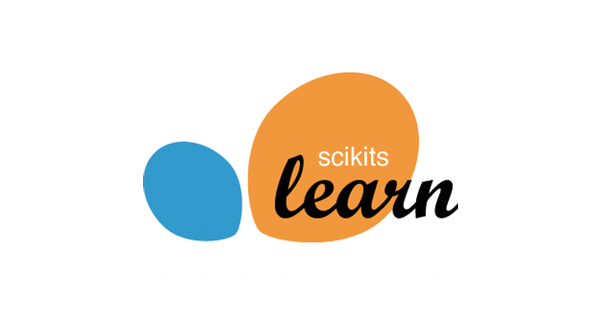

 

---

# Descrição

A modelagem preditiva agrega valor a uma grande variedade de dados, em inteligência de negócios, saúde, processos industriais e descobertas científicas. É um pilar da ciência de dados moderna. Nesse campo, o scikit-learn é uma ferramenta central: é facilmente acessível, embora poderoso, e se encaixa naturalmente no amplo ecossistema de ferramentas de ciência de dados baseadas na linguagem de programação Python.

Este curso é uma introdução detalhada à modelagem preditiva com scikit-learn. Lições passo a passo e didáticas apresentam as ferramentas metodológicas e de software fundamentais do aprendizado de máquina e são, como tal, um trampolim para desafios mais avançados em inteligência artificial, mineração de texto ou ciência de dados.

O curso é mais do que um livro de receitas: ele o ensinará a ser crítico sobre cada etapa do projeto de um pipeline de modelagem preditiva: desde as escolhas no pré-processamento de dados até a escolha de modelos, obtendo insights sobre seus modos de falha e interpretando suas previsões.

O treinamento será essencialmente prático, com foco em exemplos de aplicações com código executado pelos participantes.

Os autores do curso, também desenvolvedores do núcleo do scikit-learn, serão seus guias durante todo o treinamento!

---

# Formato

O curso abordará aspectos práticos por meio do uso de cadernos Jupyter e exercícios regulares. Ao longo do curso, destacaremos as melhores práticas do scikit-learn e daremos a você a intuição de usar o scikit-learn de uma maneira metodologicamente sólida.

---

# Plano de curso

* Módulo 1. O pipeline de modelagem preditiva
* Módulo 2. Selecionando o melhor modelo
* Módulo 3. Ajuste de hiperparâmetros
* Módulo 4. Modelos Lineares
* Módulo 5. Modelos de árvore de decisão
* Módulo 6. Conjunto de modelos
* Módulo 7. Avaliando o desempenho do modelo

---

 

